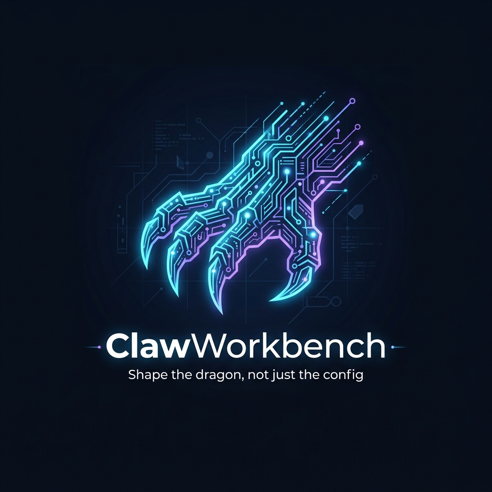

<div align="center">



### Shape the dragon, not just the config.

[](https://github.com/ccclucky/claw-workbench)
[](LICENSE)
[](https://tauri.app)
[](https://react.dev)
[](https://www.typescriptlang.org)

[**English**](README.md) · [**中文**](README.zh-CN.md)

</div>

---

## ✨ What is ClawWorkbench?

**ClawWorkbench** is a local-first desktop application for shaping AI agent behavior in [OpenClaw](https://github.com/anthropics/openclaw) workspaces. Instead of manually editing scattered config files and rules, you describe the working style, habits, and boundaries you want — and ClawWorkbench translates that intent into controlled, reviewable, and rollback-safe workspace changes.

> **The core insight:** Users don't want to configure parameters — they want to shape behavior. ClawWorkbench closes the loop from *intent* to *verified behavior change*.

## 🧠 Why ClawWorkbench?

| Problem | ClawWorkbench Solution |
|---|---|
| Editing raw config files is error-prone | Guided behavior profile builder |
| Hard to know if changes actually worked | Built-in validation & behavior briefs |
| No safe way to experiment | Full revision history with rollback |
| Preferences are lost between sessions | Template system for reusable profiles |
| No visibility into what changed | Diff preview before every apply |

## 🚀 Core Loop

```
┌─────────────┐     ┌──────────────────┐     ┌─────────────┐
│  Discover   │────▶│  Shape Behavior  │────▶│  Generate   │
│  Workspace  │     │     Profile      │     │  BuildPlan  │
└─────────────┘     └──────────────────┘     └──────┬──────┘
                                                     │
┌─────────────┐     ┌──────────────────┐     ┌──────▼──────┐
│  Validate   │◀────│  Apply Safely    │◀────│ Review Diffs│
│  Results    │     │  (with rollback) │     │             │
└─────────────┘     └──────────────────┘     └─────────────┘
```

1. **Discover Workspace** — Auto-detect and scan your OpenClaw workspace
2. **Shape Behavior Profile** — Describe your intent via chat or structured form
3. **Generate BuildPlan** — Constrained plan with file changes, risk flags, and post-apply checks
4. **Review Diffs** — File-level diff preview with per-item selection
5. **Apply Safely** — Atomic apply with automatic revision logging and rollback support
6. **Validate Results** — Structural checks, smoke tests, and a behavior effectiveness brief

## 🏗️ Architecture

```
┌──────────────────────────────────────────────────┐
│                 Tauri 2 Shell                    │
│  ┌────────────────────────────────────────────┐  │
│  │          React 19 + TypeScript             │  │
│  │  ┌──────────┐ ┌────────────┐ ┌──────────┐  │  │
│  │  │ Workspace│ │  Behavior  │ │BuildPlan │  │  │
│  │  │ Explorer │ │  Profiler  │ │ Engine   │  │  │
│  │  └──────────┘ └────────────┘ └──────────┘  │  │
│  │  ┌──────────┐ ┌────────────┐ ┌──────────┐  │  │
│  │  │   Diff   │ │  Revision  │ │Validation│  │  │
│  │  │  Viewer  │ │  Manager   │ │  Center  │  │  │
│  │  └──────────┘ └────────────┘ └──────────┘  │  │
│  └────────────────────────────────────────────┘  │
│  ┌────────────────────────────────────────────┐  │
│  │             Rust Backend                   │  │
│  │    Filesystem · SQLite · Schema Validation │  │
│  └────────────────────────────────────────────┘  │
└──────────────────────────────────────────────────┘
```

| Layer | Technology | Purpose |
|---|---|---|
| Desktop Shell | Tauri 2 | Native window, filesystem access, security sandbox |
| Frontend | React 19 + TypeScript | UI components, state management, diff rendering |
| Build System | Vite 7 | Fast HMR, bundling, dev server |
| Backend | Rust | File I/O, SQLite, schema validation, plan execution |
| Testing | Vitest + Testing Library | Unit & integration tests |

## 📦 Getting Started

### Prerequisites

| Requirement | Version | Purpose |
|---|---|---|
| [Node.js](https://nodejs.org/) | ≥ 20.x | Frontend toolchain |
| [Rust](https://rustup.rs/) | ≥ 1.75 | Tauri backend |
| [Tauri CLI](https://tauri.app/start/) | ≥ 2.x | Build & dev commands |

### Installation

```bash
# Clone the repository
git clone https://github.com/ccclucky/claw-workbench.git
cd claw-workbench

# Install dependencies
npm install

# Start development server (frontend only)
npm run dev

# Start with Tauri (full desktop app)
cargo tauri dev
```

### Build for Production

```bash
# Build frontend
npm run build

# Build desktop app
cargo tauri build
```

## 🧪 Testing

```bash
# Run all tests
npm test

# Run tests in watch mode
npx vitest

# Run with coverage
npx vitest --coverage
```

## 📂 Project Structure

```
claw-workbench/
├── src/                    # Frontend source (React + TypeScript)
│   ├── App.tsx             # Root application component
│   ├── main.tsx            # Entry point
│   ├── styles.css          # Global styles
│   └── lib/
│       └── schema/         # TypeScript schema definitions
│           ├── behaviorProfile.ts   # Behavior profile types
│           ├── buildPlan.ts         # BuildPlan types & validation
│           └── validationResult.ts  # Validation result types
├── src-tauri/              # Tauri backend (Rust)
│   ├── Cargo.toml          # Rust dependencies
│   ├── tauri.conf.json     # Tauri configuration
│   └── src/                # Rust source code
├── tests/                  # Test files
│   ├── app-shell.test.ts   # App shell tests
│   └── schema/             # Schema validation tests
├── docs/                   # Documentation
│   └── plans/              # Roadmap & planning docs
├── index.html              # HTML entry point
├── vite.config.ts          # Vite configuration
├── tsconfig.json           # TypeScript configuration
└── package.json            # Node.js dependencies
```

## 🎯 Supported Scenarios (Phase 1)

| Scenario | Description | Key Traits |
|---|---|---|
| 🖥️ **Coding** | Engineering-focused agent | Strict, verification-heavy, minimal verbosity |
| 🔬 **Research** | Research-oriented agent | Evidence-based, comparative analysis, cautious conclusions |
| ✍️ **Content** | Content creation agent | Voice-matched, style-consistent, goal-driven output |
| ⚙️ **Custom (Light)** | Custom lightweight profile | User-defined dimensions within bounded schema |

## 🗺️ Roadmap

| Phase | Status | Goal |
|---|---|---|
| **Phase 0** — Cognitive Validation | ✅ Complete | Validate behavior profile approach with real user needs |
| **Phase 1** — Trusted Loop MVP | 🔨 In Progress | Full intent → apply → validate closed loop |
| **Phase 2** — Rule Enhancement | 📋 Planned | Stronger rule registry, versioned caveats, post-apply validation |
| **Phase 3** — Asset Accumulation | 📋 Planned | Template management, evolution history, reusable style assets |

## 🤝 Contributing

Contributions are welcome! Please follow these steps:

1. **Fork** the repository
2. **Create** a feature branch (`git checkout -b feat/amazing-feature`)
3. **Commit** your changes (`git commit -m 'feat: add amazing feature'`)
4. **Push** to the branch (`git push origin feat/amazing-feature`)
5. **Open** a Pull Request

### Commit Convention

This project follows [Conventional Commits](https://www.conventionalcommits.org/):

| Prefix | Purpose |
|---|---|
| `feat:` | New feature |
| `fix:` | Bug fix |
| `docs:` | Documentation only |
| `refactor:` | Code refactoring |
| `test:` | Adding or updating tests |
| `chore:` | Build process or tooling |

## 📄 License

This project is licensed under the [MIT License](LICENSE).

---

<div align="center">

**Built with 🦞 for the OpenClaw community**

[Report Bug](https://github.com/ccclucky/claw-workbench/issues) · [Request Feature](https://github.com/ccclucky/claw-workbench/issues) · [Discussions](https://github.com/ccclucky/claw-workbench/discussions)

</div>

